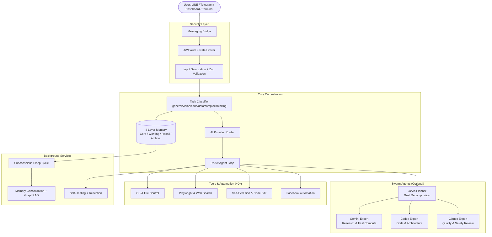

<div align="center">
  <h1>🤖 PersonalAIBot</h1>
  <p><strong>Advanced Agentic AI Platform with Multi-Agent Swarm Orchestration, 4-Layer Memory, and Autonomous Self-Evolution</strong></p>

  <p>
    
    
    
    
    
    
  </p>
</div>

---

## 🌟 Overview

**PersonalAIBot** คือแพลตฟอร์ม AI ส่วนตัวแบบ Self-Hosted ที่ออกแบบมาเพื่อทำงานคล้าย **Jarvis** ใน Iron Man โดยรวมความสามารถของ Conversational AI, Multi-Agent Orchestration, Memory Engine ระดับสูง และ Self-Evolution เข้าไว้ด้วยกัน

ระบบสามารถ:
- รับคำสั่งผ่าน **LINE, Telegram, Web Dashboard และ Terminal**
- วิเคราะห์ intent และ route งานซับซ้อนไปยัง **Swarm of AI Agents**
- **จำทุกการสนทนาตลอดชาติ** ด้วย 4-Layer Memory + Vector + GraphRAG + Embeddings 
- **แก้โค้ดตัวเองได้ (v2.6)** พร้อมระบบ rollback ป้องกันการพัง และระบบ **Resilient Batch Implementation** ที่ทำงานต่อเนื่องข้ามการรีสตาร์ท — **[UPDATE]**: เพิ่มระบบ **Line Ending Normalization** (Windows Resilience), **Robust JSON Repair** และ **Stable Status Engine** ซึ่งช่วยให้การสแกนโค้ดสม่ำเสมอและปุ่ม Pause หยุดทำงานได้ทันทีจริง 100%
- **Zero-Config Voice Experience**: ระบบสำรองการโทรด้วยเสียง (Automatic STT Fallback) พร้อมระบบล้าง URL Autostart ป้องกันการโทรเองซ้ำซ้อน
- **AI Provider และ Tooling ให้เป็นสากล (Universal AI Platform)** พัฒนาให้รองรับทุก Provider ได้อย่างราบรื่น
- **🛡️ New Security & Stability (Mar 2026)**: เพิ่มระบบ **Cold Boot Protection** และระบบ **Specialist Protocol** เพื่อให้ Jarvis ควบคุมทิศทางการใช้เครื่องมือของ Specialist ได้อย่างแม่นยำ 100%
- **🚀 UX & Resilience (Mar 2026)**: นำระบบแจ้งเตือน (Alerts) ออกทั้งหมดเพื่อความลื่นไหล, เพิ่มปุ่ม **Force Stop** หยุดงาน AI ได้ทันที และมีระบบ **JSON Self-Healing** ซ่อมแซมคำตอบจาก LLM อัตโนมัติ

- **Automate Facebook** ตอบแชท/คอมเมนต์/โพสต์อัตโนมัติ

---

## 🛠️ Tech Stack

| ด้าน | เทคโนโลยี | เวอร์ชัน |
|------|-----------|---------|
| **Runtime** | Node.js | 22.x |
| **Language** | TypeScript | 5.7 |
| **API Framework** | Express.js | 4.21 |
| **Real-time** | Socket.IO | 4.8 |
| **Database** | SQLite (better-sqlite3) | 12.6 |
| **Frontend** | React + Vite | 19 / 6.0 |
| **Styling** | TailwindCSS | 3.4 |
| **Terminal UI** | xterm.js | 6.0 |
| **AI Primary** | Google Gemini | gemini-2.0-flash / 2.5-flash / 3.1-pro |
| **AI Secondary** | OpenAI | SDK 6.25 |
| **AI CLI** | Gemini CLI, Codex CLI, Claude CLI | - |
| **Browser Automation** | Playwright (Chromium) | 1.49 |
| **LINE Bot** | @line/bot-sdk | 10.6 |
| **Telegram Bot** | Telegraf | 4.16.3 |
| **Validation** | Zod | 3.24 |
| **Logging** | Winston + daily rotate | 3.17 |
| **Encryption** | AES-256-GCM (Node crypto) | built-in |
| **PTY Terminal** | node-pty | 1.1 |

---

## 🚀 Key Architectural Features

### 🧠 4-Layer MemGPT-Inspired Memory

Memory engine ที่ออกแบบมาให้คุม context ให้อยู่ภายใน **16,000 token budget** โดยไม่สูญเสียบริบทสำคัญ:

| Layer | ชื่อ | Storage | หน้าที่ |
|-------|------|---------|---------|
| 1 | **Core Memory** | SQLite `core_memory` | ข้อมูลผู้ใช้, preferences, facts สำคัญ — โหลดทุก message |
| 2 | **Working Memory** | In-RAM LRU Cache | 5–10 ข้อความล่าสุด สำหรับ context ทันที |
| 3 | **Recall Memory** | SQLite `episodes` | ทุกบทสนทนาเก่า ค้นหาด้วย keyword |
| 4 | **Archival Memory** | SQLite + HNSW Vector + GraphRAG | Long-term facts + semantic search + knowledge graph
   - **Self-Optimization**: Autonomous code improvement via Self-Upgrade loop (Disabled by default).
   - **Second Brain Integration**: Core schema now includes codebase mapping and semantic memory tables for faster, safer upgrades. |

- **Embeddings**: Gemini-based vector embeddings พร้อม HNSW index
- **Dedup**: Cosine similarity > 0.9 ตัด duplicate อัตโนมัติ
- **GraphRAG**: เก็บ entity relationships สำหรับ complex reasoning

### 🤖 Multi-Agent Swarm Coordinator

แทนที่จะใช้ single prompt, งานซับซ้อนถูก decompose และส่งต่อ agent ที่เหมาะสม:

```
User Request
    ↓
Jarvis Planner → Goal Decomposition → Subtasks
    ↓
Specialist Dispatch
    ├── Gemini Expert   → Research, วิเคราะห์, web search
    ├── Codex Expert    → เขียนโค้ด, software architecture
    └── Claude Expert   → Quality assurance, risk analysis
    ↓
Collaboration Protocol (agents รีไฟน์งานกันเอง)
    ↓
Reviewer Gate → ตรวจสอบก่อนส่งผลลัพธ์
```

แต่ละ Expert รันใน **persistent CLI "lane"** ที่ maintain state ข้ามหลาย turns

### ⚡ Self-Evolution Engine (9-Phase Pipeline)

*   **🤖 Self-Upgrade System**: AI สามารถรับแจ้ง Issue จากระบบและสแกน codebase เพื่อหาปัญหา จากนั้นเสนอแก้โค้ด รันเทสด้วยตัวเอง และอัปเกรดตัวเองได้เลย (รองรับโหมด Shadow Edit ด้วย `selfUpgradeShadowMap` เพื่อป้องกัน `tsx watch` รีสตาร์ทกลางคันระหว่าง AI เขียนโค้ด) — **[SECURITY]**: ทุกการแก้ไขอัตโนมัติจะผ่านระบบ **Rollback & Review** เสมอ โดย AI จะทำหน้าที่เตรียมการแก้ไข (Implement) และให้ผู้ใช้ตรวจสอบความถูกต้อง (Approve Diff) ก่อนเขียนไฟล์จริง เพื่อความปลอดภัยสูงสุดของระบบ
*   **🛡️ BootGuardian Auto-Rollback**: ระบบจับการล่มของ Server ตอน Boot และถอยกลับไฟล์ให้เป็นเวอร์ชั่นก่อนหน้าอัตโนมัติหาก AI ทำโค้ดพัง (แยกการทำงานผ่าน `boot.ts` ทำให้ดักจับ Syntax Error ในระดับโครงสร้าง ES Module ได้เต็มประสิทธิภาพ)

ระบบ autonomous ที่เรียนรู้และพัฒนาตัวเองได้ — ทำงานเหมือน developer จริง: มี **Graph-Enhanced Second Brain** ที่เข้าใจโครงสร้างทั้ง codebase, วิเคราะห์ impact แบบ multi-hop, วางแผนก่อนลงมือ, เรียนรู้จากความผิดพลาด **(v2.1: ปิดทำงานเป็นค่าเริ่มต้น และตั้งค่าง่ายขึ้น)**

```
Scan → Filter → Validate → Impact Analysis → Learning → Trauma → Second Brain (Graph) → Planning → Implement → Gatekeeper → Boot Test
```

| Phase | รายละเอียด |
|-------|-----------|
| **Scan & Map** | LLM อ่าน source files ค้นหา concrete bugs (confidence > 0.7) + สกัดโครงสร้างไฟล์ลง `codebase_map` ทันที |
| **Impact Analysis** | วิเคราะห์ exported symbols → หา caller files ทั้งหมด → กำหนด risk level (safe/moderate/high) |
| **Learning Feedback** | ดึงบทเรียนจาก Learning Journal (semantic search + same-file rejection history) inject เข้า prompt |
| **Trauma Memory** | Inject recent failure patterns (TSC errors, runtime crashes) เพื่อป้องกันทำผิดซ้ำ |
| **Second Brain (Graph-Enhanced)** | ประกอบ context 4 ชั้น: ① Architecture Map (exports/deps) ② Dependency Graph (multi-hop traversal) ③ Semantic Embeddings (similar files) ④ Protected Core Files (read-only) |
| **Planning** | LLM วางแผนทีละ step — สามารถ reject proposal ตั้งแต่ขั้นวางแผนถ้าเสี่ยงเกินไป |
| **Implement** | Specialist agents (coder → reviewer → codex → claude) ทำตาม plan ทั้ง single-file และ multi-file mode |
| **Gatekeeper** | TSC baseline comparison + esbuild syntax check (stdin-piped) — reject เฉพาะ NEW errors |
| **Runtime Boot Test** | ลองบูท server จริงบน test port → ตรวจ `/health` endpoint ภายใน 4 วินาที |

#### สมองที่ 2 (Second Brain) — Graph-Enhanced Architecture Intelligence

| Layer | ตาราง | หน้าที่ |
|-------|-------|---------|
| **Architecture Map** | `codebase_map` | Summary, exports, dependencies ทุกไฟล์ (200+ files) |
| **Dependency Graph** | `codebase_edges` | Directed edges: `source --imports(symbols)--> target` สำหรับ multi-hop traversal |
| **Semantic Embeddings** | `codebase_embeddings` | Vector embeddings ของ code summaries สำหรับค้นหาไฟล์ที่คล้ายกัน |

- **Graph Traversal**: ถาม "ถ้าแก้ไฟล์นี้ จะกระทบอะไรบ้าง 2-3 ระดับลึก?" ได้ทันที
- **Upstream Context**: AI เห็น exports ของ core modules (เช่น `db.ts` export `getDb, runSql, ...`) ก่อนแก้โค้ด
- **Semantic Search**: ค้นหาไฟล์ที่ทำงานคล้ายกันเพื่อเป็น reference pattern
- **Protected Core Mapping**: 14 ไฟล์ core ไม่ถูกแก้ไข แต่ architecture ถูก map ไว้ใน Second Brain

#### คุณสมบัติเพิ่มเติม

- **Multi-File Mode**: เมื่อ risk = moderate/high, AI ได้รับ dependency graph + architecture map + affected file previews
- **Atomic Rollback**: backup ทุกไฟล์ก่อนแก้, rollback ทั้งหมดถ้าล้มเหลว
- **Resilient Status Updates**: DB errors ไม่ทำให้ proposals ค้างใน `implementing` อีกต่อไป
- **Syntax Guard (stdin-piped)**: esbuild check ใช้ stdin pipe แทน command line — รองรับไฟล์ใหญ่ไม่จำกัดขนาด
- **Circular Feedback Prevention**: rejection reasons ไม่ถูกบันทึกเป็น learnings (ป้องกัน AI reject ตัวเองวนลูป)
- **PID-Aware Recovery**: ระบบกู้คืนสถานะอัตโนมัติเมื่อเซิร์ฟเวอร์เริ่มทำงานใหม่
- **Robust JSON Repair**: ระบบซ่อมแซม JSON อัตโนมัติใน `selfUpgrade.ts` ป้องกัน Scan Failure จากคำตอบที่ LLM ทำเครื่องหมายปิดหลุดหาย
- **Windows-Ready Tooling**: เครื่องมือ `replace_code_block` รองรับการ normalize line endings (`\r\n` vs `\n`) อัตโนมัติ ป้องกันการ match พลาดบน Windows

### 🧠 Brain Visualizer (3D Unified Topology) [NEW]

ระบบแสดงผลโครงสร้าง "สมอง" ของ AI แบบ 3D ทรงประสาท (Neural Graph Visualization) ที่ช่วยให้เห็นการทำงานภายในแบบ Real-time:
- **First Brain**: แสดงผลตารางหน่วยความจำส่วนหน้า (Conversations, Messages, Core Memory)
- **Second Brain**: แสดงผลโครงสร้างสถาปัตยกรรมโค้ด (Codebase Map, Dependencies, Evolution Log)
- **Real-time Activity Pulse**: แสดงผลการรับส่ง Token และการทำงานของตารางฐานข้อมูลด้วยเอฟเฟกต์วงแหวนแสงและอนุภาค
- **Unified Topology**: เชื่อมโยง Agent ต่างๆ (Jarvis, Bots, Specialists) เข้ากับส่วนประกอบของระบบที่พวกมันกำลังใช้งานอยู่


### 🛡️ Boot Guardian & Immortal Core

- **Boot Guardian** (`bootGuardian.ts`) — ดัก Node.js crash ภายใน 15 วินาทีหลัง startup, auto-rollback ถ้าพบ upgrade breadcrumb + **WAL checkpoint** เพื่อ persist status ข้าม rapid restarts. บังคับ Rollback ทันทีถ้าพบ Syntax Error แม้จะติด upgrade lock
- **Immortal Core Sandbox** — 14 ไฟล์ core system ถูก hardcode ป้องกัน AI แก้ไข แต่ architecture ถูก map เข้า Second Brain (`index.ts`, `config.ts`, `db.ts`, `selfUpgrade.ts`, `agent.ts`, `tools/index.ts` ฯลฯ)
- **Circuit Breaker** — แต่ละ AI provider มี circuit breaker แยก ป้องกัน cascading failure
- **🔒 Cold Boot Protection (Safety Switch)** — เมื่อเริ่มเซิร์ฟเวอร์ใหม่ ระบบจะสร้าง `COLD_BOOT.flag` เพื่อสั่ง **ปิด (Lock)** ระบบอัตโนมัติทั้งหมดทันที จนกว่าผู้ใช้จะกดเปิดด้วยตนเอง เพื่อความปลอดภัยสูงสุด (ป้องกัน Loop ของ AI ที่ไม่ตั้งใจ)
- **🔍 AI TRACE (Comprehensive Auditing)** — ระบบบันทึกการทำงานของ AI Specialist อย่างละเอียด (Transcript Log) ทั้งฝั่งระบบและ AI ทำให้ผู้ใช้ตามรอยได้ว่า AI ตัดสินใจอะไร ใช้เครื่องมือไหน และได้ผลลัพธ์อย่างไร แบบโปร่งใส
- **Provider Fallback** — Gemini → OpenAI → Custom CLI อัตโนมัติ

### ⏰ Autonomous Cron Jobs & Self-Scheduling

ระบบสามารถลุกขึ้นมาทำงานเองโดยไม่ต้องมีคนสั่งผ่านแชท โดยใช้ AI เป็นผู้จัดการตารางเวลาตัวเอง:

- **Headless Execution**: ตั้ง Cron Expression (เช่น `0 8 * * *`) แล้วแนบ AI Prompt. เมื่อถึงเวลา ระบบจะรัน Agentic Loop แบบเบื้องหลัง (Background) แล้วส่งผลลัพธ์ผ่าน Webhook กลับไปยัง LINE/Telegram โดยตรง
- **Agent Self-Scheduling Tools**: AI สามารถสร้างตารางงานให้ตัวเองได้จากคำสั่งเสียง/แชท (เช่น "สรุปข่าวทุก 8 โมงให้หน่อย" → AI จะรัน `create_cron_job()`)
- **Admin Dashboard**: หน้าต่างจัดการตารางเวลาแบบ Visual (ดู/แก้ไข/หยุดชั่วคราว) ข้อมูลทั้งหมดบันทึกลง SQLite `cron_jobs`

---

## 🏗️ System Topology



---

## 💻 Dashboard & Administration

React 19 + Vite + TailwindCSS dashboard มีหน้าดังนี้:

| หน้า | หน้าที่ |
|------|---------|
| **Home** | Dashboard overview, system status |
| **Settings** | ตั้งค่า AI provider, routing, API keys, bot behavior |
| **Jarvis Call** | Voice/audio interface พร้อม recording |
| **Swarm Monitor** | Real-time visualization ของ agent tasks |
| **Jarvis Terminal** | Full xterm.js terminal ใน browser (shell/agent/CLI mode) |
| **Memory Viewer** | ดู/แก้ไข Core Memory, Archival Memory, Vector Store |
| **Personas** | จัดการ AI personality profiles |
| **Logs** | Activity logs, error logs, audit trail |

---

## 🗄️ Database Schema (SQLite — 16+ Tables)

| Table | หน้าที่ |
|-------|---------|
| `conversations` | Thread การสนทนาทั้งหมด |
| `messages` | ประวัติ chat (indexed by conversation + timestamp) |
| `user_profiles` | Core facts, preferences ต่อผู้ใช้ (JSON) |
| `core_memory` | Memory blocks แบบ key-value ต่อ chat |
| `episodes` | Working memory — ทุก message เก่า (indexed) |
| `archival_memory` | Long-term facts + Gemini embedding BLOB |
| `knowledge` | Semantic facts (parallel semantic store) |
| `api_keys` | Encrypted credential storage (AES-256-GCM) |
| `qa_pairs` | Q&A override rules (exact/contains/regex) |
| `personas` | AI personality profiles (JSON traits) |
| `scheduled_posts` | Facebook posts ที่รอส่ง |
| `cron_jobs` | ตารางเวลางาน Agent อัตโนมัติ (AI Self-Scheduling) |
| `comment_watches` | Facebook posts ที่รอ auto-reply comment |
| `replied_comments` | Dedup — comment ที่ตอบไปแล้ว |
| `activity_logs` | Audit trail ทุก action |
| `settings` | Key-value system configuration |
| `upgrade_proposals` | Proposals จาก Self-Upgrade scan (title, description, file_path, status, priority, affected_files, impact_analysis) |
| `codebase_map` | แผนที่โครงสร้างโค้ดประดุจสมองที่ 2 (Second Brain) — เก็บ summary, exports, dependencies ทุกรอบการสแกน |
| `codebase_edges` | กราฟเชื่อมโยง dependency (source→target directed edges พร้อม imported symbols) สำหรับ multi-hop impact analysis |
| `codebase_calls` | [NEW] บันทึกความสัมพันธ์การเรียกฟังก์ชัน (Caller/Callee) สำหรับการวิเคราะห์เชิงลึก |
| `codebase_embeddings` | Semantic vectors ของ code summaries สำหรับค้นหาไฟล์ที่คล้ายกัน (cosine similarity) |
| `upgrade_scan_log` | [NEW] บันทึกผลการสแกนหาช่องโหว่และจุดที่ควรปรับปรุงในโค้ด |
| `evolution_log` | บันทึกประวัติ self-upgrade/heal/reflect ทุกครั้ง |
| `learning_journal` | Persistent learnings (6 categories, confidence, times_applied, vector-indexed) |
| `processed_messages` | Message dedup cache (ป้องกัน double-process) |


---

## 🔌 API Endpoints (50+)

### Authentication
```
GET  /api/auth/socket-token   → Socket.IO auth token (localhost only)
POST /api/auth/login           → JWT login
POST /api/auth/logout          → Clear session
```

### AI & Chat
```
POST /api/chat                → Send message (triggers full agentic loop)
POST /api/chat/stream          → Streaming response (public)
POST /api/ai/test              → Test AI providers
GET  /api/ai/models            → List available models
GET  /api/config               → AI routing config
POST /api/config               → Update routing config
```

### Memory & Conversations
```
GET  /api/memory/core          → Core memory blocks
POST /api/memory/core/:block   → Update core memory
GET  /api/memory/conversations → List conversations
GET  /api/memory/search        → Semantic search archival memory
```

### Personas & Q&A
```
GET/POST/PUT/DELETE /api/personas      → CRUD personas
GET/PUT             /api/bot-personas/:platform → Bot identity files
GET/POST/PUT/DELETE /api/qa            → CRUD Q&A rules
POST                /api/qa/test       → Test Q&A pattern
```

### Dynamic Tools
```
GET/POST/DELETE /api/dynamic-tools         → Manage hot-reloadable tools
POST            /api/dynamic-tools/:name/test → Test tool
POST            /api/dynamic-tools/refresh    → Hot-reload all tools
```

### Facebook & Automation
```
POST /api/fb/login             → Facebook login (email/password via Playwright)
GET  /api/fb/status            → Check login status
GET/POST/DELETE /api/posts     → Scheduled posts
GET/POST/DELETE /api/comments/watches → Comment auto-reply rules
```

### Swarm & Batch
```
GET  /api/swarm/tasks          → List swarm tasks
POST /api/swarm/batch          → Submit batch task
GET  /api/swarm/batch/:id      → Batch status
POST /api/swarm/approve        → Approve pending task
```

### Automation & API Providers
```
GET/POST/PUT/DELETE /api/cron-jobs     → Manage AI scheduled tasks
GET/POST/PUT/DELETE /api/providers     → Dynamic AI Provider management
```

### System & Admin
```
GET  /api/status               → Bot/browser/chat monitor status
GET  /api/system/health        → Full system health
POST /api/system/restart       → Restart server
POST /api/system/upgrade       → Trigger self-upgrade
GET  /metrics                  → Prometheus metrics
GET  /api-docs                 → Swagger UI (OpenAPI)
```

### Terminal (Socket.IO events)
```
terminal:create   → Create shell / agent / CLI session
terminal:input    → Send input to PTY session
terminal:resize   → Resize terminal window
terminal:close    → Close session
terminal:list     → List active sessions
```

---

## 🛠️ Dynamic Tools Registry (40+)

ระบบ tools ที่รองรับ parallel execution สำหรับ read-only และ sequential สำหรับ mutations:

| หมวด | Tools |
|------|-------|
| **OS & File** | `run_command`, `run_python`, `read_file_content`, `replace_code_block`, `search_codebase` |
| **Browser** | `mouse_click`, `keyboard_type`, `screenshot_desktop`, `fetch_url` |
| **Web** | `google_search`, `extract_table` |
| **Media** | `generate_image`, `generate_speech`, `generate_video` (Provider Agnostic) |
| **Office** | `read_document`, `create_document`, `edit_document`, `read_google_doc` (PDF, Word, Excel, CSV) |
| **Cron Jobs** | `create_cron_job`, `list_cron_jobs`, `delete_cron_job` (AI Self-Scheduling) |
| **Dynamic** | Hot-reloadable JSON-defined tools จาก `server/dynamic_tools/` |

---

## 📱 Platform Integrations

### LINE Messenger
- Webhook-based message handling
- Configurable bot persona ต่อ platform (`personas/line/`)
- Support multitype messages (text, image, sticker)

### Telegram
- Long-polling via Telegraf
- Bot persona แยกต่างหาก (`personas/telegram/`)
- Inline commands support

### Facebook Automation (Playwright)
- Auto-login ด้วย email/password (พร้อม cookie persistence)
- **Chat Monitor** — ตรวจ inbox และตอบ message อัตโนมัติ
- **Comment Bot** — watch posts และตอบ comment ด้วย AI
- **Post Scheduler** — generate content + โพสต์ตามเวลาที่กำหนด
- Anti-detection: random typing delays (30–80ms/char), random reply delays (3–15s)

### Jarvis Terminal (Web)
- xterm.js + FitAddon สำหรับ responsive terminal
- 3 session modes:
  - `shell` — OS terminal ตรงๆ
  - `agent` — AI agent ด้วย full toolset
  - `cli` — Gemini / Codex / Claude CLI

---

## 🔒 Security

| Feature | รายละเอียด |
|---------|-----------|
| **Authentication** | JWT token สำหรับ dashboard + Socket.IO token |
| **Encryption** | AES-256-GCM สำหรับ API keys ใน database |
| **Rate Limiting** | 10 AI chats/min, 5 generations/min per user |
| **Input Validation** | Zod schema validation บน POST/PUT ทุกตัว |
| **ReDoS Protection** | ทดสอบ regex patterns ก่อน save (50ms timeout) |
| **Admin Resilience** | รหัสผ่านผู้ดูแลระบบถูกเข้ารหัส AES-256 ลง SQLite โดยตรง (ไม่ถูกล็อคจาก env อีกต่อไป) |
| **Crash Alerts** | หาก Puppeteer พังหรือเกิด Fatal Error ระบบจะส่งแจ้งเตือนด่วนผ่าน Telegram/LINE ให้ Admin ทันที |
| **CORS** | Whitelist: localhost:3000, 5173, 5174 |
| **Security Headers** | CSP, HSTS, X-Frame-Options, X-Content-Type-Options |
| **Sanitization** | XSS/injection prevention ทุก input |
| **Boot Guardian** | Rollback อัตโนมัติถ้า AI แก้โค้ดแล้วพัง |

---

## ⚙️ Quick Start

### Prerequisites
- Node.js v22.x
- npm หรือ yarn
- Google Gemini API Key (required)
- LINE / Telegram token (optional)

### Installation

**Windows:**
```bat
git clone https://github.com/skyliner2008/PersonalAIBot.git
cd PersonalAIBot
install.bat
```

**Linux / macOS / WSL:**
```bash
git clone https://github.com/skyliner2008/PersonalAIBot.git
cd PersonalAIBot
chmod +x install.sh
./install.sh
```

**Docker:**
```bash
docker-compose up -d
```

### Configuration

ระบบใช้โครงสร้างแบบ **Database-First** เพื่อความปลอดภัยระดับสูงสุด โดยค่าความลับส่วนใหญ่จะถูกเก็บและเข้ารหัส **AES-256-GCM** ไว้ในฐานข้อมูล SQLite คุณเพียงแค่ตั้งค่าพื้นฐานใน `server/.env`:

```env
# Server
PORT=3000
NODE_ENV=production

# 🔒 Master Encryption Key (สำคัญ: ใช้ปลดล็อคฐานข้อมูลที่เข้ารหัส)
CRED_SECRET=your_32_char_master_key

# Admin Notifications
ADMIN_TELEGRAM_IDS=5888914941
```

**สิ่งที่ถูกย้ายลงฐานข้อมูลแล้ว (ไม่ต้องใส่ใน .env)**:
- `GEMINI_API_KEY`, `OPENAI_API_KEY` และ AI Providers อื่นๆ
- `JWT_SECRET` (โทเค็นล็อกอิน)
- `ADMIN_USER` & `ADMIN_PASSWORD` (รหัสผ่าน Dashboard)
- LINE/Telegram Bot Tokens และเซสชันการเชื่อมต่อ

**หมายเหตุ**: คุณสามารถตั้งค่า API Keys และรหัสผ่านได้โดยตรงผ่านหน้า Dashboard หลังจากรันระบบครั้งแรก (รหัสผ่านเริ่มต้นคือ `admin / admin`)

**ระบบอัจฉริยะในเวอร์ชันนี้**:
- **Auto-Detect Embedding**: ระบบจะตรวจจับ API Key ที่คุณมี (Gemini, OpenAI, หรือ OpenRouter) และเลือกใช้ระบบหน่วยความจำทางภาษา (Semantic Memory) ที่เหมาะสมที่สุดให้โดยอัตโนมัติ เพื่อให้ Fresh Install ทำงานได้ทันที
- **Auto-Purge (ล้างข้อมูล)**: หากมีการเปลี่ยนแปลง `CRED_SECRET` หรือไฟล์ Salt ในภายหลัง ระบบจะทำการล้างเฉพาะส่วนที่ถอดรหัสไม่ได้ทิ้งโดยอัตโนมัติเพื่อความปลอดภัยและความเสถียรถาวร คุณเพียงแค่กรอก API Key ใหม่ผ่าน Dashboard อีกครั้งก็เป็นอันเสร็จสิ้น

### Launch

**Windows:**
```bat
start_unified.bat
```

**Linux / macOS:**
```bash
# Start server
cd server && npm start

# Start dashboard (separate terminal)
cd dashboard && npm run preview
```

**Docker:**
```bash
docker-compose up
```

Dashboard จะเปิดที่ `http://localhost:3000`

---

## 📁 Project Structure

```
PersonalAIBot/
├── server/
│   ├── src/
│   │   ├── index.ts                 # Main entry point
│   │   ├── bootGuardian.ts          # Crash recovery & rollback
│   │   ├── api/                     # Express routes + Socket handlers
│   │   ├── ai/                      # AI routing + Persona manager
│   │   ├── swarm/                   # Multi-agent orchestration
│   │   │   ├── swarmCoordinator.ts  # Core orchestrator
│   │   │   ├── jarvisPlanner.ts     # ReAct goal planner (928 lines)
│   │   │   ├── specialists.ts       # Agent role definitions
│   │   │   └── roundtable.ts        # Multi-agent collaboration
│   │   ├── memory/                  # 4-layer memory engine
│   │   │   ├── unifiedMemory.ts     # Orchestrator (930 lines)
│   │   │   ├── embeddingProvider.ts # Gemini embeddings + HNSW
│   │   │   ├── graphMemory.ts       # GraphRAG knowledge graph
│   │   │   └── vectorStore.ts       # HNSW vector index
│   │   ├── bot_agents/              # Core agent loop + 40+ tools
│   │   │   ├── agent.ts             # Main agent loop
│   │   │   └── tools/               # Tool implementations
│   │   ├── terminal/                # Jarvis Terminal Gateway
│   │   ├── evolution/               # Self-evolution (11-phase pipeline + Graph-Enhanced Second Brain)
│   │   │   ├── selfUpgrade.ts      # Core upgrade engine (~1700 lines)
│   │   │   ├── selfReflection.ts   # Performance analysis
│   │   │   ├── selfHealing.ts      # Auto health checks
│   │   │   └── learningJournal.ts  # Persistent learning + semantic search
│   │   ├── automation/              # Facebook Playwright automation
│   │   ├── database/                # SQLite schema + migrations
│   │   ├── providers/               # AI provider adapters
│   │   └── utils/                   # Auth, logger, rate limiter
│   └── package.json
│
├── dashboard/                       # React 19 + Vite frontend
│   └── src/
│       ├── pages/                   # Home, Settings, Terminal, Memory...
│       ├── components/              # Toast, XTerminal, GenerativeUI
│       └── services/api.ts          # REST + Socket.IO client
│
├── personas/                        # Bot identity files
│   ├── line/                        # LINE bot persona
│   ├── telegram/                    # Telegram bot persona
│   └── facebook/                    # Facebook bot persona
│
├── data/                            # Runtime data (gitignored)
│   ├── fb-agent.db                  # SQLite database
│   ├── cookies/                     # Browser session cookies
│   └── uploads/                     # User uploaded files
│
├── docs/                            # 20+ documentation files
├── ai_routing_config.json           # AI model routing config
├── docker-compose.yml               # Docker deployment
├── Dockerfile                       # Container image
├── install.bat                      # Windows modular installer
├── install.sh                       # Linux/macOS modular installer [NEW]
├── start.bat                        # Start script
└── start_unified.bat                # Unified launcher
```

---

## 📊 AI Routing Configuration

ระบบ route งานแต่ละ type ไปยัง model ที่เหมาะสมอัตโนมัติ (`ai_routing_config.json`):

```json
{
  "autoRouting": true,
  "routes": {
    "general":  { "provider": "gemini", "model": "gemini-2.5-flash" },
    "vision":   { "provider": "gemini", "model": "gemini-2.5-flash" },
    "web":      { "provider": "gemini", "model": "gemini-2.5-flash" },
    "code":     { "provider": "gemini", "model": "gemini-2.5-flash" },
    "data":     { "provider": "gemini", "model": "gemini-2.5-flash" },
    "complex":  { "provider": "gemini", "model": "gemini-2.5-flash" },
    "thinking": { "provider": "gemini", "model": "gemini-2.5-flash" },
    "system":   { "provider": "gemini", "model": "gemini-2.5-flash" }
  }
}
```

สามารถ override ต่อ bot ได้ด้วย `botOverrides` section

---

## 📚 Documentation

| ไฟล์ | รายละเอียด |
|------|-----------|
| [ARCHITECTURE.md](ARCHITECTURE.md) | System design overview |
| [docs/SWARM_ARCHITECTURE.md](docs/SWARM_ARCHITECTURE.md) | Multi-agent swarm details |
| [docs/PHASE_3_VECTOR_MEMORY.md](docs/PHASE_3_VECTOR_MEMORY.md) | 4-layer memory implementation |
| [docs/PROJECT_SYSTEM_HANDBOOK.md](docs/PROJECT_SYSTEM_HANDBOOK.md) | Comprehensive system handbook |
| [docs/IMPLEMENTATION_CHECKLIST.md](docs/IMPLEMENTATION_CHECKLIST.md) | Boot Guardian & infrastructure protections |
| [.agent/skills/unified_bot_v2/SKILL.md](.agent/skills/unified_bot_v2/SKILL.md) | Authoritative system design manifest |

---

## ⚠️ Known Limitations & Areas for Improvement

- **Test Coverage**: ~13% — swarmCoordinator และ terminalGateway ยังขาด unit tests
- **Large Files**: `swarmCoordinator.ts` และ `terminalGateway.ts` ควร refactor ต่อไป
- **Type Safety**: มี ~239 occurrences ของ `any` type ที่ควรแก้ไข
- **Memory Pagination**: Working memory load ยังไม่มี pagination
- **Credentials**: ไม่ควร fallback ไปใช้ default JWT_SECRET ใน production

---

<div align="center">
  <i>"I am Jarvis. What are we building today, sir?"</i>
  <br/><br/>
  <sub>Built with ❤️ — PersonalAIBot v2.6 | Last updated: 30 March 2026</sub>
</div>

